# Microsoft Sentinel Threat Hunt — Meridian Health

End-to-end Microsoft Sentinel threat hunt using KQL to investigate reconnaissance, path traversal/LFI, credential theft, SSH compromise, privilege escalation, persistence, command and control, data exfiltration, defense evasion, and incident response.

> **Environment:** Cyber Range / Simulated SOC Investigation  
> **Platform:** Microsoft Sentinel / Azure Log Analytics  
> **Query Language:** Kusto Query Language (KQL)  
> **Target:** Ubuntu-based healthcare patient portal  
> **Primary Goal:** Reconstruct attacker activity, distinguish true positives from defensive noise, identify remediation gaps, and determine remaining incident-response actions.

---

## Executive Summary

This project documents an end-to-end threat hunt performed in Microsoft Sentinel against a simulated compromise of a Linux-based healthcare patient portal.

Using KQL, I correlated web, authentication, Linux audit, Syslog, network, database, process, and defensive telemetry to reconstruct a multi-stage intrusion involving reconnaissance, path traversal/local file inclusion, credential theft, SSH access, privilege escalation, persistence, command-and-control activity, patient-data exfiltration, defense evasion, and incident response.

A major challenge in the investigation was separating genuine attacker activity from telemetry generated by an automated defense stack. The investigation also identified several response gaps, including a persistent backdoor that survived automated remediation and the accidental removal of `sysmon.service`, which created a process-level telemetry blind spot during the incident.

The final response phase included volatile-memory acquisition with AVML before determining that the surviving backdoor still required manual termination.

---

## Project Overview

- **SIEM:** Microsoft Sentinel
- **Language:** KQL
- **Operating System:** Ubuntu Linux
- **Application Stack:** Apache, PHP, MySQL
- **Attacker IP:** `10.1.134.57`
- **Target Host:** `10.1.15.67`
- **Attack Window:** February 6, 2026
- **Primary Investigation Areas:**
  - Reconnaissance
  - Initial access
  - Credential access
  - Valid-account abuse
  - Privilege escalation
  - Persistence
  - Command and control
  - Collection / exfiltration
  - Defense evasion
  - Incident response

---

## Environment

The investigation was performed in the `LAW-HuntPractice` Microsoft Sentinel / Log Analytics workspace.

The primary telemetry sources included:

| Table | Purpose |
|---|---|
| `MeridianAccess_CL` | Apache web access activity |
| `MeridianAuth_CL` | SSH and authentication events |
| `MeridianAudit_CL` | Linux audit/process execution telemetry |
| `MeridianDefender_CL` | Automated defense-stack detections and remediation |
| `MeridianSyslog_CL` | Linux Syslog and service activity |
| `MeridianSnapshot_CL` | Process snapshots and UID information |
| `MeridianNetwork_CL` | Network connection snapshots |
| `MeridianMySQL_CL` | MySQL activity |

A critical investigation requirement was using `EventTime_t` as the true event timestamp rather than ingestion time.

Example:

```kusto
| where EventTime_t between (datetime(2026-02-06) .. datetime(2026-02-07))
| where isnotempty(EventTime_t)
```

---

## Skills Demonstrated

- Microsoft Sentinel
- Azure Log Analytics
- Kusto Query Language (KQL)
- SIEM investigation
- Threat hunting
- Timeline reconstruction
- Linux security monitoring
- Web access log analysis
- SSH authentication analysis
- Linux audit log analysis
- Syslog analysis
- Process execution analysis
- Linux UID analysis
- Credential-access investigation
- Privilege-escalation analysis
- SUID exploitation analysis
- Persistence detection
- Command-and-control investigation
- Network telemetry analysis
- Data exfiltration investigation
- MySQL activity analysis
- False-positive analysis
- Detection validation
- Incident containment
- Incident eradication analysis
- Forensic memory acquisition
- AVML
- MITRE ATT&CK mapping
- Cross-table telemetry correlation

---

## Attack Timeline

| Phase | Finding |
|---|---|
| Reconnaissance | Nmap, curl, WhatWeb, and Gobuster identified |
| Initial Access | `config_viewer.php` identified as a vulnerable endpoint |
| File Access | Path traversal/LFI used to retrieve `/etc/passwd` and `database.conf` |
| Credential Access | Configuration data exposed reusable credentials |
| Valid Account | `svc_backup` successfully accessed the host over SSH |
| Privilege Escalation | `sudo` attempt failed; SUID shell `/tmp/rootbash -p` succeeded |
| Persistence | `/opt/meridian/scripts/health_check` remained active with elevated privileges |
| Command & Control | Persistent backdoor repeatedly attempted `10.1.134.57:43212` |
| Collection | Full patient dataset activity and patient-data export identified |
| Defense Evasion | Bootstrap noise separated from real attacker activity |
| Detection Gap | `sysmon.service` removed by automated remediation |
| Incident Response | AVML captured memory to `/tmp/evidence/memory.lime` |
| Final Action | `health_check` still required manual termination |

---

# Investigation

## 1. Reconnaissance

The attacker used multiple reconnaissance tools against the web application.

The tools were identified by grouping HTTP requests by user-agent and determining when each first appeared.

### KQL

```kusto
MeridianAccess_CL
| where EventTime_t between (datetime(2026-02-06) .. datetime(2026-02-07))
| where isnotempty(EventTime_t)
| where ClientIp_s == "10.1.134.57"
| summarize
    FirstSeen=min(EventTime_t),
    RequestCount=count()
    by UserAgent_s
| sort by FirstSeen asc
```

### Findings

The reconnaissance sequence was:

1. Nmap
2. curl
3. WhatWeb
4. Gobuster

Gobuster generated the largest volume of requests, indicating automated directory enumeration.

### Evidence

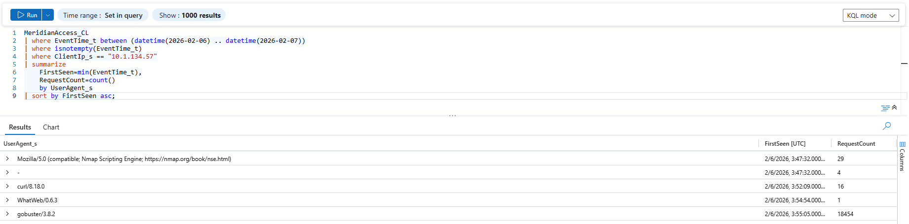

*Figure 1: User-agent analysis identified the attacker’s reconnaissance sequence as Nmap, curl, WhatWeb, and Gobuster.*

### Analyst Takeaway

User-agent analysis can help distinguish different stages of attacker reconnaissance and reveal whether activity was automated or manually driven.

---

## 2. Initial Access

Before large-scale directory enumeration began, the attacker directly accessed:

```text
/config_viewer.php
```

This indicated that the attacker may already have known about the endpoint before beginning broader enumeration.

The endpoint accepted a `file` parameter that was insufficiently restricted.

### Evidence

The attacker later requested:

```text
/config_viewer.php?file=../../../etc/passwd
```

and:

```text
/config_viewer.php?file=database.conf
```

Both returned HTTP `200` responses.

### Retrieved Files

```text
/etc/passwd
database.conf
```

`/etc/passwd` provided valid Linux account information, while `database.conf` exposed reusable connection credentials.

### Screenshot Evidence

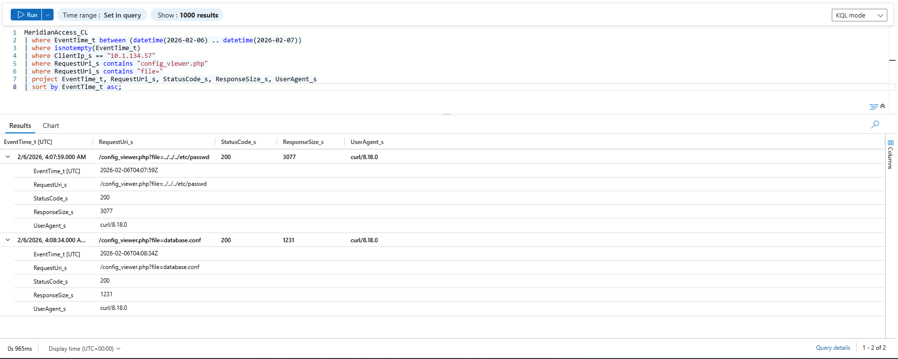

*Figure 2: Requests to `config_viewer.php` show successful path traversal/LFI activity used to retrieve sensitive files.*

### Analyst Takeaway

Successful HTTP responses combined with meaningful response sizes provided stronger evidence of successful file retrieval than the suspicious URI alone.

---

## 3. Credential Access

Shortly after `database.conf` was retrieved, the attacker authenticated over SSH using an existing account:

```text
svc_backup
```

The successful SSH login occurred approximately 57 seconds after the configuration file was accessed.

### KQL

```kusto
MeridianAuth_CL
| where EventTime_t between (datetime(2026-02-06) .. datetime(2026-02-07))
| where isnotempty(EventTime_t)
| where ProcessName_s == "sshd"
| where RawMessage_s contains "Accepted"
| where SourceIP == "10.1.134.57"
| project EventTime_t, TargetUser_s, SourceIP, SourcePort_s, RawMessage_s
| sort by EventTime_t asc
```

### Finding

```text
Accepted password for svc_backup from 10.1.134.57
```

### Evidence

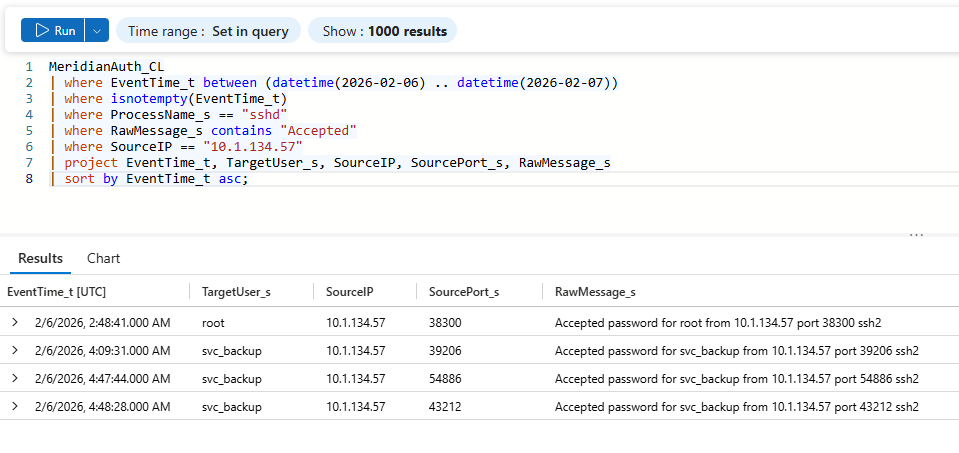

*Figure 3: Authentication telemetry shows successful SSH access using the `svc_backup` account from the confirmed attacker IP.*

### Analyst Takeaway

The short time interval between configuration-file access and successful SSH authentication strongly supported credential reuse.

---

## 4. Privilege Escalation

The attacker attempted multiple methods to obtain root access.

### Failed Method 1: sudo

The compromised `svc_backup` account attempted to use `sudo`.

The request failed because the account was not authorized to execute the requested command as root.

```text
svc_backup : command not allowed ; USER=root
```

### Failed Method 2: Direct Root SSH

The attacker also attempted direct SSH authentication as `root`.

The authentication logs showed:

```text
Failed password for root
```

### Successful Method: SUID Root Shell

The attacker successfully executed:

```text
/tmp/rootbash -p
```

### Targeted KQL

```kusto
MeridianAudit_CL
| where EventTime_t between (datetime(2026-02-06 04:35:00) .. datetime(2026-02-06 04:45:00))
| where isnotempty(EventTime_t)
| where comm_s == "rootbash"
   or exe_s contains "rootbash"
   or Argv_s contains "rootbash"
| project EventTime_t, comm_s, exe_s, auid_s, euid_s, Argv_s
| sort by EventTime_t asc
```

### Key Evidence

```text
auid_s = 1001
euid_s = 0
Argv_s = /tmp/rootbash -p
```

The original authenticated user was associated with UID `1001`, while the process executed with effective UID `0`, confirming root-level execution.

### Screenshot Evidence

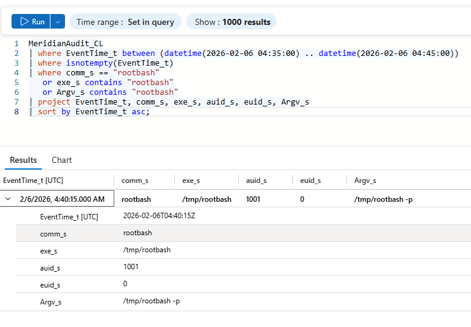

*Figure 4: Linux audit telemetry shows `/tmp/rootbash -p` executing with effective UID 0, confirming successful privilege escalation.*

### Analyst Takeaway

Comparing original and effective UIDs can provide strong evidence of successful Linux privilege escalation.

---

## 5. Persistence

The attacker established a second, less obvious privileged foothold:

```text
/opt/meridian/scripts/health_check
```

Unlike `/tmp/rootbash`, this path looked consistent with a legitimate application maintenance component.

### KQL

```kusto
MeridianSnapshot_CL
| where EventTime_t between (datetime(2026-02-06) .. datetime(2026-02-07))
| where isnotempty(EventTime_t)
| where isnotempty(ProcBeaconExeLink_s)
| project
    EventTime_t,
    ProcBeaconName_s,
    ProcBeaconExeLink_s,
    ProcBeaconUid_s,
    ProcBeaconPid_s,
    ProcBeaconPPid_s
| sort by EventTime_t asc
```

### Key Evidence

```text
Process: health_check
Path: /opt/meridian/scripts/health_check
PID: 267155
PPID: 1
UIDs: 1001 0 0 0
```

The real UID remained associated with the compromised account while the process retained root-level effective privileges.

### Remediation Gap

The automated sweep detected:

```text
Non-baseline file in scripts/: health_check
```

but did not remove it.

The automated response handled specific artifact categories such as:

- SSH keys
- crontabs
- temporary directories
- watched SUID paths
- selected systemd services

The application scripts directory was outside those remediation rules.

### Screenshot Evidence

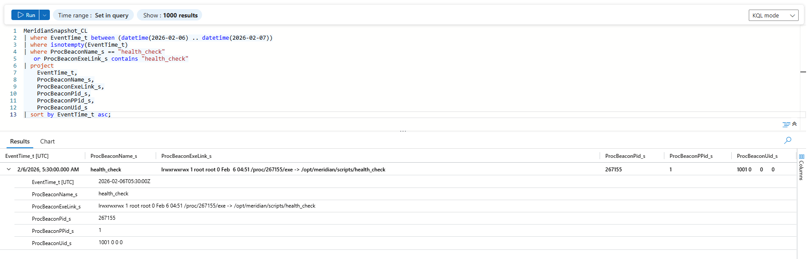

*Figure 5: Process snapshot telemetry shows the `health_check` backdoor operating from a legitimate-looking application path with elevated privileges.*

### Analyst Takeaway

Detection coverage and remediation coverage are not the same. A control can correctly identify suspicious activity while still failing to remove the threat.

---

## 6. Command and Control

The persistent `health_check` backdoor repeatedly attempted outbound communication to:

```text
10.1.134.57:43212
```

The network defense blocked 73 connection attempts.

### KQL

```kusto
MeridianDefender_CL
| where EventTime_t between (datetime(2026-02-06) .. datetime(2026-02-07))
| where isnotempty(EventTime_t)
| where EventCategory_s == "NETWORK"
| project EventTime_t, SourceIP, DestIp_s, DestPort_s, RawMessage_s
| sort by EventTime_t asc
```

### Evidence

```text
Blocked exfil to 10.1.134.57:43212
```

However, a later process snapshot showed `health_check` was still running.

### Conclusion

The firewall successfully blocked the C2 communication, but the backdoor itself was **not neutralized**.

### Screenshot Evidence

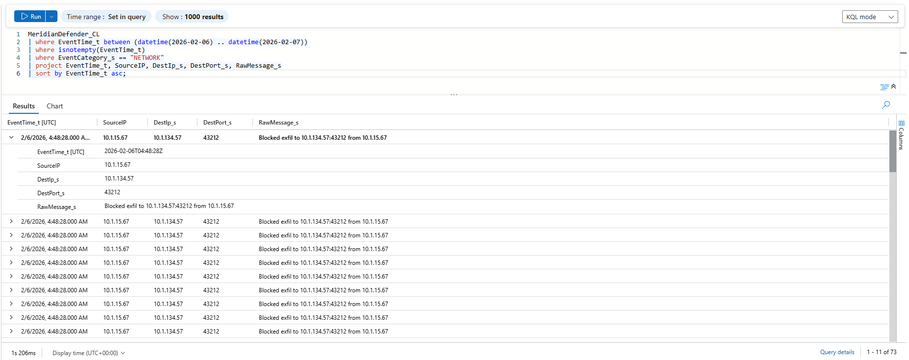

*Figure 6: Repeated outbound communication to the C2 destination was blocked, but process telemetry later confirmed the backdoor remained active.*

### Analyst Takeaway

```text
Blocked network traffic ≠ malware eradication
```

The control achieved network-layer containment but not host-level eradication.

---

## 7. Collection / Exfiltration

The defense telemetry showed activity involving the application's patient dataset.

### Evidence

```text
Full patient table query
```

and:

```text
Patient data export from 10.1.134.57
```

### Finding

The affected data was:

```text
Patient data
```

Because this was a healthcare environment, this represented a high-impact data exposure scenario involving sensitive patient information.

### Screenshot Evidence

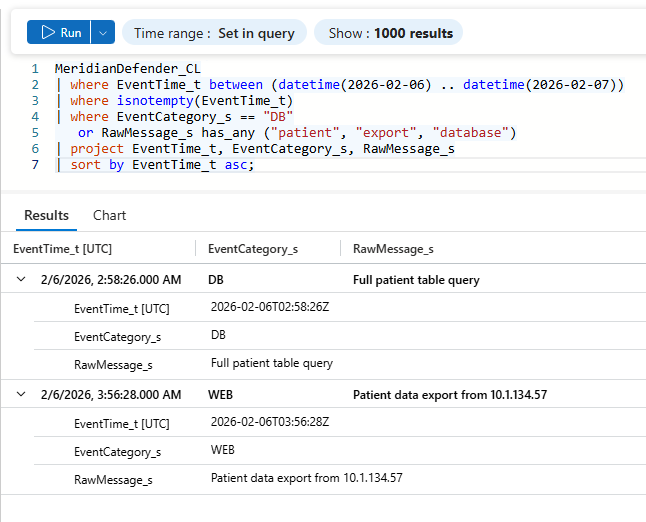

*Figure 7: Defender telemetry identified both full patient-table access and patient-data export activity.*

### Additional Finding

The final automated sweep also detected:

```text
backup.conf tampered -- reverting
```

This showed that the attacker or associated tooling modified application configuration data as part of the intrusion.

### Analyst Takeaway

Identifying the specific affected data type is essential for determining business impact, breach severity, and incident-response priorities.

---

## 8. Defense Evasion and Detection Gaps

### False-Positive Bootstrap Activity

Before the confirmed intrusion began, the automated defense stack generated a burst of detections involving:

- SSH key modifications
- crontab modifications
- new systemd services

These changes were automatically reverted.

Cross-referencing the detection timestamps against the confirmed attacker IP showed no matching attacker activity at the time of the detection burst.

### Conclusion

The early events were:

```text
False-positive / bootstrap noise
```

generated by the defensive environment itself.

### Evidence

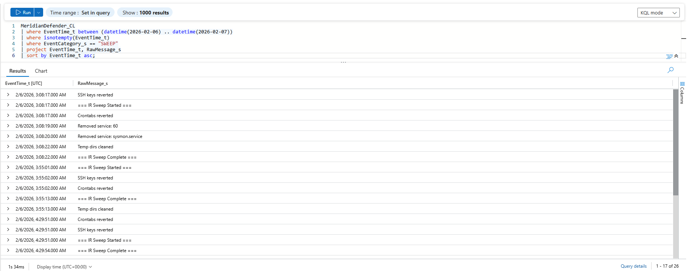

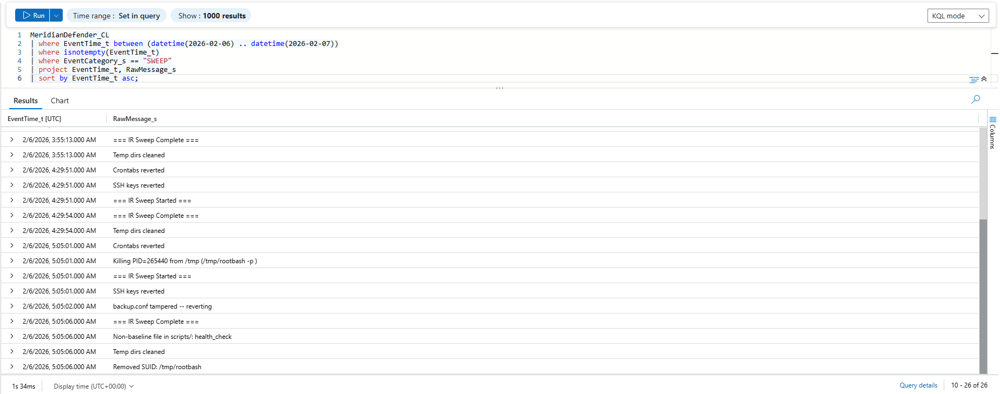

*Figure 8: Automated defense activity generated its own telemetry and remediation actions, requiring correlation to distinguish setup noise from genuine attacker behavior.*

### Analyst Takeaway

A detection event alone is not proof of malicious activity. Independent telemetry should be used to validate whether attacker behavior actually occurred.

---

### Collateral Damage: Sysmon Removal

The first automated sweep removed:

```text
sysmon.service
```

### Defender Evidence

```text
Removed service: sysmon.service
```

Syslog showed that Sysmon had been functioning as legitimate defensive tooling:

```text
Starting Sysmon event logger...
Sysmon v1.5.0 - Monitors system events
```

Removing Sysmon created process-level telemetry gaps for later portions of the investigation.

### Screenshot Evidence

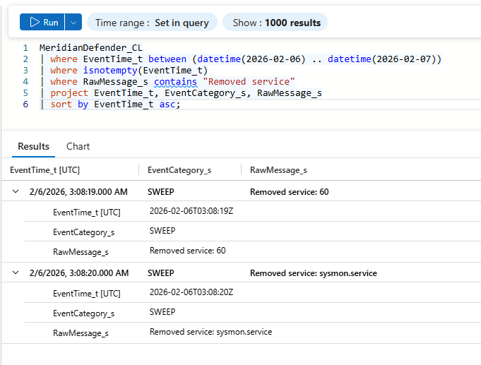

*Figure 9: Automated remediation removed `sysmon.service`, unintentionally reducing process-level visibility during the remainder of the incident.*

### Analyst Takeaway

Over-aggressive automated remediation can impair defensive visibility and make incident reconstruction more difficult.

---

## 9. Incident Response

Before disturbing the still-running backdoor, the returning administrator acquired volatile memory using AVML.

### KQL

```kusto
MeridianAudit_CL
| where EventTime_t between (datetime(2026-02-06 05:00:00) .. datetime(2026-02-06 05:30:00))
| where isnotempty(EventTime_t)
| where comm_s contains "avml"
    or exe_s contains "avml"
    or Argv_s contains "avml"
| project EventTime_t, comm_s, exe_s, auid_s, euid_s, Argv_s
| sort by EventTime_t asc
```

### Evidence

AVML was executed twice:

```text
/tmp/avml /tmp/evidence/memory.lime
```

### Tool

```text
AVML
```

### Memory Image

```text
/tmp/evidence/memory.lime
```

This preserved volatile evidence before additional remediation actions changed process or memory state.

### Screenshot Evidence

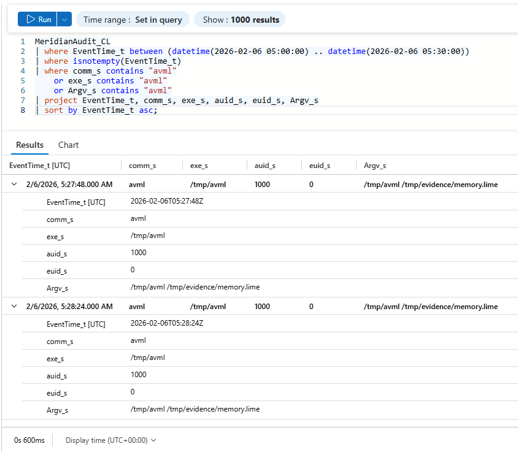

*Figure 10: Linux audit telemetry shows repeated AVML execution writing volatile memory to `/tmp/evidence/memory.lime`.*

---

### Final Remaining Response Action

Despite the automated sweep, C2 blocking, and forensic memory acquisition, the following backdoor remained active:

```text
/opt/meridian/scripts/health_check
```

The final required manual action was:

```text
Manually terminate and remove the health_check backdoor process.
```

### Analyst Takeaway

Evidence acquisition is not eradication. An incident should not be considered contained while an active malicious process remains on the system.

---

# Key KQL Queries

### Full KQL Query Pack

The complete set of validated Microsoft Sentinel queries used during this investigation is available here:

[View the full Meridian Threat Hunt KQL file](queries/meridian-threat-hunt.kql)

---

## Reconnaissance Tool Identification

```kusto
MeridianAccess_CL
| where EventTime_t between (datetime(2026-02-06) .. datetime(2026-02-07))
| where isnotempty(EventTime_t)
| where ClientIp_s == "10.1.134.57"
| summarize
    FirstSeen=min(EventTime_t),
    RequestCount=count()
    by UserAgent_s
| sort by FirstSeen asc
```

## Successful SSH Authentication

```kusto
MeridianAuth_CL
| where EventTime_t between (datetime(2026-02-06) .. datetime(2026-02-07))
| where isnotempty(EventTime_t)
| where ProcessName_s == "sshd"
| where RawMessage_s contains "Accepted"
| project EventTime_t, TargetUser_s, SourceIP, SourcePort_s, RawMessage_s
| sort by EventTime_t asc
```

## SUID Privilege Escalation

```kusto
MeridianAudit_CL
| where EventTime_t between (datetime(2026-02-06 04:35:00) .. datetime(2026-02-06 04:45:00))
| where isnotempty(EventTime_t)
| where comm_s == "rootbash"
   or exe_s contains "rootbash"
   or Argv_s contains "rootbash"
| project EventTime_t, comm_s, exe_s, auid_s, euid_s, Argv_s
| sort by EventTime_t asc
```

## Persistent Backdoor Identification

```kusto
MeridianSnapshot_CL
| where EventTime_t between (datetime(2026-02-06) .. datetime(2026-02-07))
| where isnotempty(EventTime_t)
| where ProcBeaconName_s == "health_check"
   or ProcBeaconExeLink_s contains "health_check"
| project
    EventTime_t,
    ProcBeaconName_s,
    ProcBeaconExeLink_s,
    ProcBeaconPid_s,
    ProcBeaconPPid_s,
    ProcBeaconUid_s
| sort by EventTime_t asc
```

## C2 / Network Defense Activity

```kusto
MeridianDefender_CL
| where EventTime_t between (datetime(2026-02-06) .. datetime(2026-02-07))
| where isnotempty(EventTime_t)
| where EventCategory_s == "NETWORK"
| project EventTime_t, SourceIP, DestIp_s, DestPort_s, RawMessage_s
| sort by EventTime_t asc
```

## Memory Acquisition

```kusto
MeridianAudit_CL
| where EventTime_t between (datetime(2026-02-06 05:00:00) .. datetime(2026-02-06 05:30:00))
| where isnotempty(EventTime_t)
| where comm_s contains "avml"
    or exe_s contains "avml"
    or Argv_s contains "avml"
| project EventTime_t, comm_s, exe_s, auid_s, euid_s, Argv_s
| sort by EventTime_t asc
```

---

# MITRE ATT&CK / Hunt Mapping

> Note: Most mappings below represent attacker behavior observed during the hunt. A small number reflect defensive or incident-response activity mapped by the cyber range for investigation context.

| Technique ID | Technique | Investigation Evidence |
|---|---|---|
| T1595 | Active Scanning | Nmap and web reconnaissance |
| T1190 | Exploit Public-Facing Application | Vulnerable `config_viewer.php` |
| T1552.001 | Credentials In Files | Credentials exposed through configuration files |
| T1078 | Valid Accounts | `svc_backup` used for successful SSH authentication |
| T1548.001 | Setuid and Setgid | `/tmp/rootbash -p` |
| T1036.005 | Match Legitimate Name or Location | `health_check` hidden in application scripts directory |
| T1071 | Application Layer Protocol | Repeated outbound C2 attempts |
| T1213 | Data from Information Repositories | Patient data collection/export |
| T1565.001 | Stored Data Manipulation | `backup.conf` tampering |
| T1562.001 | Impair Defenses | Automated remediation unintentionally removed `sysmon.service`, creating a telemetry gap |
| T1005 | Data from Local System | Responder used AVML to acquire volatile memory during incident response |

---

# Detection and Response Gaps

Several important defensive gaps were identified during the investigation.

### 1. Detection Without Remediation

The defense stack detected:

```text
health_check
```

as a non-baseline artifact but had no remediation rule capable of removing it from the application scripts directory.

### 2. Network Containment Without Eradication

The firewall blocked repeated C2 connections to:

```text
10.1.134.57:43212
```

but the malicious process remained active.

### 3. Defensive Tooling Generated False Positives

Bootstrap activity generated detections resembling attacker persistence behavior.

Without cross-table correlation, these events could have been incorrectly classified as malicious.

### 4. Automated Response Removed Legitimate Security Tooling

The response system removed:

```text
sysmon.service
```

creating a significant process-level visibility gap.

### 5. Manual Remediation Was Still Required

The `health_check` backdoor survived automated response activity until explicitly addressed.

---

# Incident Response Findings

The investigation demonstrated the difference between several incident-response concepts:

### Detection

Identifying suspicious or malicious behavior.

### Containment

Preventing further attacker activity, such as blocking outbound C2 traffic.

### Evidence Preservation

Capturing volatile memory before terminating the malicious process.

### Eradication

Removing malicious processes, binaries, persistence, and other attacker artifacts.

### Final Finding

The environment was not fully contained until the surviving `health_check` backdoor was manually terminated and removed.

---

# Lessons Learned

### Correlation Is More Valuable Than a Single Alert

No single telemetry source told the entire story. Web, authentication, audit, Syslog, process, network, database, and defense telemetry had to be correlated to reconstruct the intrusion.

### Detection Does Not Equal Remediation

A security tool can detect malicious activity while failing to remove it.

### Containment Does Not Equal Eradication

Blocking outbound C2 traffic prevented communication but did not remove the persistent process.

### Failed Attacker Actions Are Valuable Evidence

Failed `sudo` and root SSH attempts revealed attacker intent and showed which security controls were functioning correctly.

### False Positives Require Context

Defensive bootstrap activity initially resembled attacker persistence. Independent telemetry was necessary to correctly classify the events.

### Automated Response Can Cause Collateral Damage

Removing `sysmon.service` created a visibility gap and demonstrated why automated remediation should be carefully scoped.

### Preserve Volatile Evidence Before Remediation

AVML memory acquisition preserved evidence from the live system before the malicious process was disturbed.

---

# Tools Used

- Microsoft Sentinel
- Azure Log Analytics
- Kusto Query Language (KQL)
- Linux Audit Framework
- Syslog
- Apache access logs
- SSH authentication logs
- MySQL logs
- Linux process snapshots
- AVML
- MITRE ATT&CK

---

# Repository Structure

```text
microsoft-sentinel-meridian-threat-hunt/
│
├── README.md
│
├── screenshots/
│   ├── 01-reconnaissance-tools.png
│   ├── 02-path-traversal-lfi.png
│   ├── 03-svc-backup-ssh.png
│   ├── 04-suid-root-shell.png
│   ├── 05-health-check-persistence.png
│   ├── 06-c2-blocking.png
│   ├── 07-patient-data-export.png
│   ├── 08a-ir-sweep-defense-actions.png
│   ├── 08b-ir-sweep-remediation-actions.png
│   ├── 09-sysmon-removal.png
│   └── 10-avml-memory-acquisition.png
│
└── queries/
    └── meridian-threat-hunt.kql
```

---

# Portfolio Context

This investigation was completed in a controlled cybersecurity range designed to simulate real SOC threat-hunting and incident-response workflows.

The purpose of this project is to demonstrate practical experience with:

- Microsoft Sentinel
- KQL
- SIEM investigation
- Threat hunting
- Telemetry correlation
- MITRE ATT&CK
- Linux security analysis
- Incident response

No production systems or real patient information were involved.
